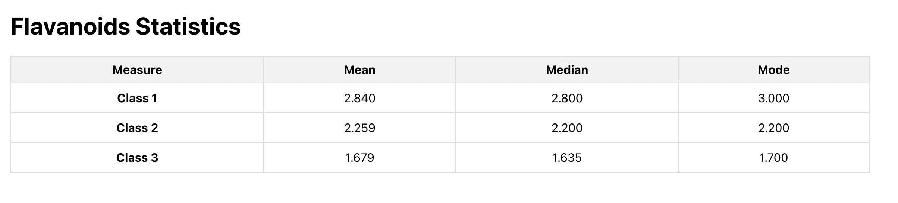
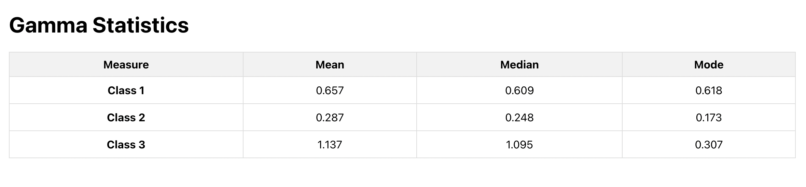

# Statistical Measures Calculator

This project calculates class-wise statistical measures for the given dataset and displays the results in a tabular format using React.

## Table of Contents

- [Description](#description)
- [Screenshots](#screenshots)
- [Installation](#installation)
- [Usage](#usage)

## Description

The purpose of this project is to calculate and display class-wise mean, median, and mode values for the "Flavanoids" and "Gamma" properties from the dataset.

The calculations are performed using custom utility functions without any third-party libraries.

## Screenshots

### Flavanoids Statistics

### Gamma Statistics

## Installation

1. Clone the repository:

git clone https://github.com/sharmarajat01/manufac-task.git

2. Change to the project directory:

cd manufac-task

3. Install dependencies:

npm install

## Usage

1. Run the project:

npm start

2. Access the project in your web browser at `http://localhost:3000/`.

